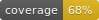
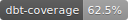

<div align="center">

[](https://www.python.org/downloads/release/python-390/)
[](https://github.com/Bilbottom/jaffle-shop/commits/main)
[](https://github.com/dbrgn/coverage-badge)
[](https://github.com/google/pybadges)

[](https://github.com/prettier/prettier)
[](https://github.com/psf/black)
[](https://pycqa.github.io/isort/)
[](https://github.com/pre-commit/pre-commit)
[](https://sourcery.ai)

</div>

---

## Testing dbt project: `jaffle-shop`

This is a fork of the [dbt-labs/jaffle_shop](https://github.com/dbt-labs/jaffle_shop) repo but to show off some Sainsbury's extensions.

- https://github.com/dbt-labs/jaffle_shop

This project has only been tested using Python 3.9 with the dependencies listed in the requirements files. Since this is a project just for testing, we're only using SQLite and dbt version 1.4.

## Getting started

Install Python 3.9 and the dependencies listed in the requirements files.

The `jaffle_shop` directory has the usual dbt objects and can be run in the usual way. The unit tests for the dbt models are in the `tests` subdirectory.

The `code_coverage` directory is the package that will generate a coverage metric for the dbt models' unit tests. We can't measure line hits like we can with Python code, but we can measure the number of models that have unit tests and _which of their CTEs_ have unit tests.

To run the code coverage report, compile the project and run the code coverage package:

```bash
dbt clean
dbt deps

dbt compile
python -m code_coverage
```

Help for the `code_coverage` package can be generated using the `--help` flag thanks to [the `typer` library](https://typer.tiangolo.com/):

```bash
python -m code_coverage --help
```

## Summary of extensions

### CTE unit testing

This builds off of another fork, this one from the [EqualExperts/dbt-unit-testing](https://github.com/EqualExperts/dbt-unit-testing) repo:

- https://github.com/Bilbottom/dbt-unit-testing

This fork adds the ability to unit test particular CTEs in a model, provided you follow [the dbt-labs style guide](https://github.com/dbt-labs/corp/blob/main/dbt_style_guide.md) and include [the `select * from final` line](https://github.com/dbt-labs/corp/blob/725b6e9cf2af208d24a52fc04095c2feaff20b9d/dbt_style_guide.md?plain=1#L157-L158) at the bottom of the model.

### Code coverage

With the CTE unit tests, we can then measure the number of (logical) CTEs that don't have tests which forms the coverage metric.

## Future plans

The v1.5 release of [dbt-core](https://github.com/dbt-labs/dbt-core) introduced programmatic invocations:

- https://docs.getdbt.com/reference/programmatic-invocations

This would allow us to piggyback off of the dbt functionality even more, rather than hacking together our own solutions.
